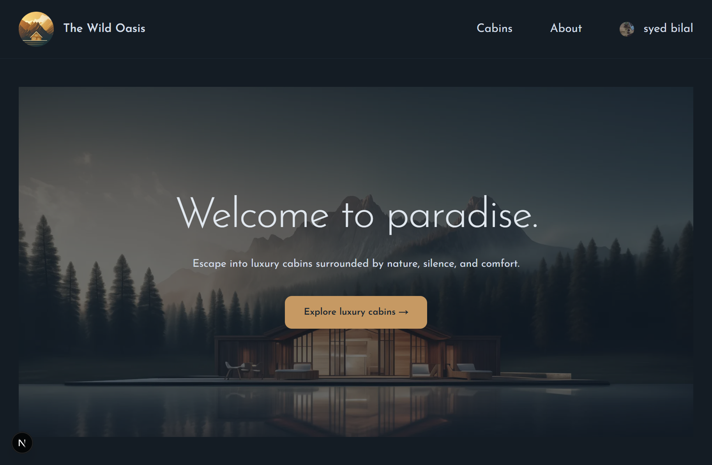

# 🌲 The Wild Oasis

A modern hotel/cabin booking web application built with **Next.js 16 (App Router)**, inspired by Jonas Schmedtmann’s Ultimate Next.js course on Udemy.

The Wild Oasis allows users to browse cabins, make reservations, manage bookings, and update their profile — all powered by a server-first architecture with Supabase.

---

## 🚀 Live Demo

[Link](https://wild-oasis-three-gray.vercel.app/)

---

## 📸 Screenshots



---

## 🧠 Features

- 🏡 Browse luxury cabins
- 📅 Book available dates with dynamic pricing
- 👤 Google authentication (NextAuth)
- 📋 Manage reservations (edit / delete bookings)
- 🧾 Guest profile management
- 🔐 Secure server actions (Next.js Server Actions)
- ⚡ Supabase backend integration
- 📱 Fully responsive UI
- 🎨 Modern UI with Tailwind CSS

---

## 🛠️ Tech Stack

- **Next.js 16 (App Router)**
- **React**
- **Tailwind CSS**
- **Supabase (Database)**
- **NextAuth.js (Authentication)**
- **date-fns**
- **Server Actions (Next.js)**
- **Vercel (Deployment)**

---

## ⚙️ Getting Started

### 1. Clone the repo

```bash
git clone https://github.com/iamsyedbilal/react-mastery-journal/wild-oasis
cd wild-oasis
```
